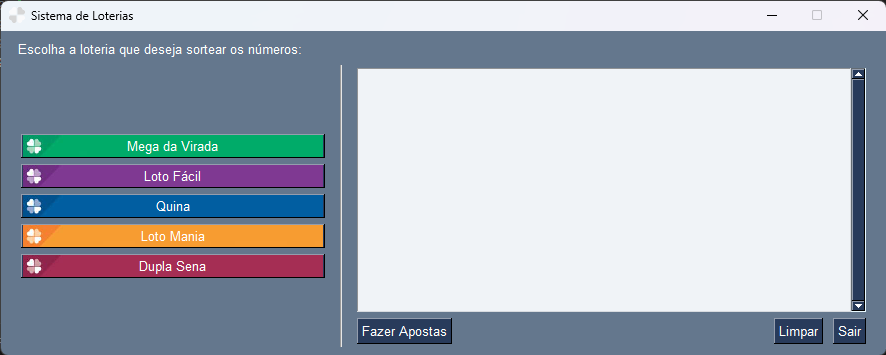

# App-Loterias




## Sobre

> Aplicativo que gera automaticamente números para os principais jogos de loteria da Caixa e realiza a aposta de forma automática.


##  Tecnologias Utilizadas

* [Python](https://www.python.org/)
* [Selenium](https://selenium-python.readthedocs.io/)
* [webdriver-manager](https://pypi.org/project/webdriver-manager/)
* [PySimpleGUI](https://www.pysimplegui.org/en/latest/)
* [Email](https://docs.python.org/3/library/email.examples.html)

## 💻 Pré-requisitos

Antes de começar, verifique se você atendeu aos seguintes requisitos:

* [Git](https://git-scm.com/)
* [Python](https://www.python.org/)

## 🚀 Instalando app-loterias

Para instalar a app-loterias, siga estas etapas:

Clone o repositório no diretório desejado:
```
git clone https://github.com/LuanCarvalho0/app-loterias.git
```

Para acessar o diretório do projeto, use o comando:
```
cd app-loterias
```

Windows:
```
python -m venv nome_do_ambiente
```

```
nome_do_ambiente\Scripts\activate
```

Instale as Dependências:
```
pip install -r requirements.txt
```

## ☕ Como rodar o projeto

Para rodar o projeto app-loterias, siga esta etapa:

```
python src/app.py
```

## 📝 Licença

Esse projeto está sob licença. Veja o arquivo [LICENÇA](LICENSE) para mais detalhes.
